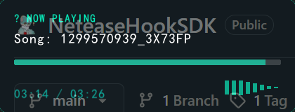

# NeteaseHookSDK (v0.1.2)

**[状态: BETA]** **[架构: Hybrid (CDP + WebAPI)]** **[平台: Windows x86/x64]**
 



## 1. 项目摘要

NeteaseHookSDK 是针对网易云音乐 (Netease Cloud Music) 桌面客户端的进程度监控与状态捕获解决方案。本项目旨在解决传统内存扫描 (Memory Scanning) 方案在对抗应用频繁更新、V8 引擎指针压缩 (Pointer Compression) 及堆布局随机化 (Heap Randomization) 时的脆弱性问题。

通过利用 Electron 框架内置的 Chrome DevTools Protocol (CDP) 调试接口，本项目构建了一个非侵入式的 IPC 桥接层，同时结合轻量级 WebAPI 客户端，实现了**“状态监听 + 数据补全”**的双模工作流。

**版本**: 0.1.2 (Integration Beta)

## 2. 技术规格

| 组件 | 说明 |
| :--- | :--- |
| **Agent** | `version.dll` (Proxy DLL)。劫持进程启动参数，注入 `--remote-debugging-port=9222`。 |
| **Driver** | C++ 静态链接库。封装 HTTP/WebSocket 协议，管理 CDP 会话生命周期。 |
| **Bridge** | 注入式 JavaScript Payload。利用 `Runtime.evaluate` 挂钩渲染进程 IPC。 |
| **Utils** | C++ 工具模块 (`Netease::API`)。提供歌词获取 (Cache-Aside)、元数据查询与缓存管理。 |
| **Interface** | 标准 C ABI (`extern "C"`). 支持多语言绑定 (FFI)。 |

## 3. 核心机制

### 3.1 启动参数劫持 (Bootstrap Hijacking)
利用 Windows PE 加载器特性，通过放置特制的 `version.dll` 在应用程序目录，优先于系统 DLL 加载。Agent 模块挂钩 `GetCommandLineW`，在命令行缓冲区末尾追加调试端口参数，迫使 Electron 开启远程调试服务。

### 3.2 IPC 总线监听 (IPC Bus Sniffing)
网易云音乐前端业务逻辑高度依赖自定义的 IPC 通道。逆向分析确认其通过 `window.channel.registerCall(event, callback)` 分发播放器事件。
SDK 驱动层通过 WebSocket 连接至渲染进程，动态注入代码注册 `audioplayer.onPlayProgress` 监听器，从而获得与原生 UI 完全同步的播放状态数据。

### 3.3 状态提取策略 (State Extraction)
*   **进度**: 直接监听 `onPlayProgress` 事件。
*   **总时长**: 采用 DOM/React Fiber 混合探测技术 (`input[type="range"]` / `fiber.memoizedProps`)。
*   **元数据**: 调用 `Netease::API` 模块，通过 SongID 从官方 API 获取详细信息（封面、专辑、艺术家）。

### 3.4 智能歌词系统 (Smart Lyric System)
*   **Cache-Aside**: 优先读取本地缓存（兼容网易云官方加密/非加密格式）。
*   **Auto-Fallback**: 缓存未命中时自动从 API 获取，并以官方兼容格式回写本地。
*   **Robust Parsers**: 手写状态机 JSON 解析器，完美处理转义字符与异常响应。

### 3.5 标准化日志系统 (Standardized Logging)
*   **跨模块同步**: 日志状态同步在 DLL 内核，确保主程序与驱动层开关完全一致。
*   **分级审计**: 为 API, Driver, Audio 捕获等模块设置独立 Tag, 支持定向审计.
*   **绝对静默 (Absolute Silence)**: v0.1.2 新增物理级静默接口，通过重定向 `stderr` 到 `NUL` 强力压制所有第三方库噪音。

### 3.6 健壮性与稳定性 (Robustness)
*   **端口冲突识别**: 自动检测 9222 端口是否被非网易云程序占用（如 Chrome 调试页、验证码 Mock 等）。
*   **重连退避机制 (Backoff)**: 驱动层与应用层重连间隔优化为 3s，彻底解决连接失败时的“死循环刷屏”问题。

## 4. 构建与部署

### 4.1 编译环境
*   CMake >= 3.20
*   MSVC v142+ (Visual Studio 2022)
*   GoogleTest (通过 CMake FetchContent 自动下载)

### 4.2 编译命令
```powershell
cmake -B build -S . -DCMAKE_BUILD_TYPE=Release
cmake --build build --config Release
```

### 4.3 部署/安装 (Installation)

SDK 提供了自动化安装接口，无需手动复制文件。

**方法 A: 使用 Demo 工具自动安装 (推荐)**
1.  运行 `build/bin/NeteaseMonitor.exe` (Demo App)。
2.  按下快捷键 `Ctrl + I` (Install)。
3.  工具会自动将 `version.dll` 部署到网易云安装目录，并自动重启网易云音乐。

**方法 B: 手动部署 (Manual)**
1.  编译生成 `version.dll`。
2.  将 `version.dll` 复制到 NCM 安装根目录 (`%ProgramFiles(x86)%\Netease\CloudMusic`)。
3.  重启目标进程。

## 5. 演示程序 (NeteaseMonitor)

`NeteaseMonitor` 是一个基于 Raylib 开发的轻量级可视化监控工具，展示了 SDK 的所有功能。

### 5.1 交互说明
| 动作 | 快捷键 | 说明 |
| :--- | :--- | :--- |
| **安装 Hook** | `Ctrl` + `I` | 自动部署 Agent DLL 并重启网易云 |
| **强制重启** | `Ctrl` + `K` | 终止并重启网易云进程 (Apply Hook) |
| **刷新路径** | `Ctrl` + `R` | 重新检测网易云安装路径 |
| **移动窗口** | `Left Drag` | 点击任意位置拖拽悬浮窗 |

## 6. 如何集成到您的项目 (Integration Guide)

### 6.1 获取 SDK

从 Release 页面下载预编译包，或自行编译：
```powershell
cmake -B build -S . -DCMAKE_BUILD_TYPE=Release
cmake --build build --config Release
cmake --install build --prefix ./dist
```

### 6.2 集成方式

**方式 A: 动态加载 (推荐)**
```c
HMODULE hDll = LoadLibraryA("NeteaseDriver.dll");
typedef bool (*Fn_Connect)(int);
Fn_Connect Connect = (Fn_Connect)GetProcAddress(hDll, "Netease_Connect");
Connect(9222);
```

**方式 B: 静态链接**
```cmake
target_link_libraries(YourApp PRIVATE NeteaseDriver)
```

### 6.3 环境要求

*   Windows 7+ (x64/x86)
*   网易云音乐客户端
*   MSVC Runtime (通常已预装)

## 7. API 接口 (C-ABI)

详细接口定义请参阅 [API 参考手册](docs/API.md)。

```c
// 物理级彻底静默 (压制所有噪音)
void Netease_SetAbsoluteSilence(bool enable);

// 逻辑日志开关与级别
void Netease_SetGlobalLogging(bool enabled);
void Netease_SetGlobalLogLevel(int level);

// 自动安装 Hook
bool Netease_InstallHook(const char* dllPath);
```

## 8. 发布包结构 (Release Package)
 
从 GitHub Release 下载的压缩包 (`.zip`) 解压后包含以下目录：
 
```text
NeteaseHookSDK-v0.1.2/
├── bin/
│   ├── x86/              # [32位]
│   │   ├── NeteaseMonitor.exe  # Demo 应用
│   │   ├── NeteaseDriver.dll
│   │   ├── version.dll
│   │   └── resources/          # 运行时资源
│   │       └── shaders/
│   │           ├── aurora.fs
│   │           ├── glass.fs
│   │           └── circle_mask.fs
│   └── x64/              # [64位]
│       ├── NeteaseMonitor.exe  # Demo 应用
│       ├── NeteaseDriver.dll
│       ├── version.dll
│       └── resources/          # 运行时资源
│           └── shaders/
│               ├── aurora.fs
│               ├── glass.fs
│               └── circle_mask.fs
├── include/              # [开发] 头文件
│   ├── NeteaseDriver.h   # CDP 驱动核心接口
│   ├── NeteaseAPI.h      # WebAPI 工具接口 (v0.1.2)
│   ├── SharedData.hpp    # 跨模块状态结构定义
│   ├── SimpleLog.h       # 标准化日志系统 (v0.1.2)
│   └── LogRedirect.h     # 物理重定向工具 (v0.1.2)
├── lib/                  # [开发] 静态导入库
│   └── NeteaseDriver.lib # 链接时使用 (仅 MSVC)
├── examples/             # [示例]
│   └── c_demo.c          # C 语言调用范例
└── docs/                 # [文档] 离线文档
```
 
### 快速使用指引

#### A. 运行 Demo 应用
1.  **进入对应架构目录**: `cd bin/x64` (或 `bin/x86`)
2.  **直接运行**: `NeteaseMonitor.exe`
3.  **首次安装 Hook**: 按 `Ctrl + I`，程序将自动部署并重启网易云
4.  **最低需求**: Windows 7+ 系统，需安装 [VC++ 2015-2022 运行库](https://aka.ms/vs/17/release/vc_redist.x64.exe)

#### B. 集成到开发项目
1.  将 `include` 目录添加到编译器的 Include Path。
2.  将 `lib` 目录添加到链接器的 Library Path。
3.  链接 `NeteaseDriver.lib`。
4.  将 `bin/{arch}/NeteaseDriver.dll` 复制到程序运行目录。
 
## 9. 目录结构 (源码)
 
*   `src/Agent`: DLL 代理与 Hook 实现 (MinHook)
*   `src/Driver`: CDP 协议驱动与状态机 (C++)
*   `src/Utils`: WebAPI 客户端与缓存管理 (`Netease::API`)
*   `src/Shared`: 跨模块共享数据定义
*   `src/App`: Raylib 可视化 Demo (展示 SDK 功能)
*   `tests`: GoogleTest 单元测试套件
*   `examples`: 跨语言调用范例
 
## 10. 法律免责

本项目仅供逆向工程研究与安全分析用途。使用本项目所产生的任何后果由使用者自行承担。
